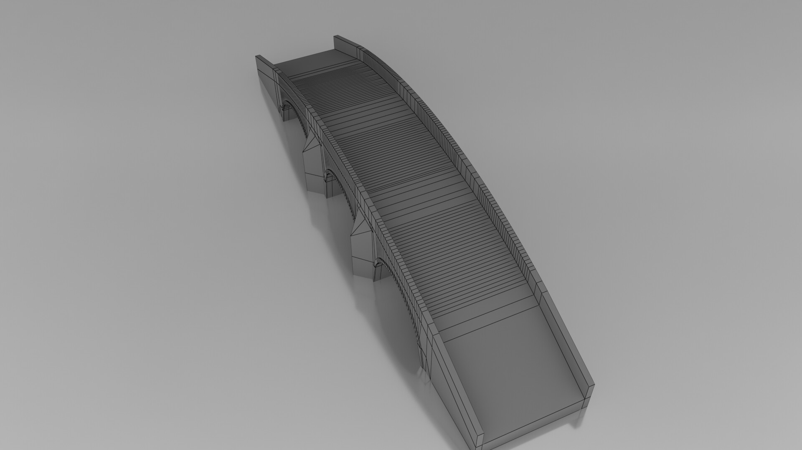

# Bridge Design
## Date: 21 - 05 - 2025

### Developed By : **BALASUBRAMANIAM L - 212224240020**

## AIM
To create a 3D model of a bridge structure using Autodesk Fusion 360.

## REQUIREMENTS
1. Autodesk Fusion 360
2. Windows 10
3. 16 GB of RAM (Integrated graphics recommend 1 GB or more)
4. 2.5 Mbps or faster download; 500 Kbps or faster upload

## PROCEDURE

### STEP-1: Start a New Design
   1. Open Autodesk Fusion 360.
   2. Create a New Design file.

### STEP-2: Create the Base Sketch
   1. Select **Sketch > Create Sketch**.
   2. Choose the **Top Plane (XY Plane)**.

### STEP-3: Draw the Base of the Bridge
   1. Use the **Line** and **Rectangle** tools to draw the basic base frame for the bridge.
   2. Create two **rectangular bases** to represent the bridge supports.

### STEP-4: Extrude the Bases
   1. Select **Create > Extrude**.
   2. Extrude the rectangular bases upwards to give them thickness.

### STEP-5: Create the Bridge Deck
   1. Start a new **Sketch** on top of the supports.
   2. Draw a **Rectangle** to represent the bridge deck between the supports.
   3. Finish the sketch.
   4. Use **Extrude** to give thickness to the deck.

### STEP-6: Create Support Trusses
   1. Start a **new Sketch** on the side faces of the deck.
   2. Draw **triangular truss patterns** using the **Line** tool.
   3. Finish the sketch.

### STEP-7: Cut Out the Trusses
   1. Select the truss sketch.
   2. Use **Extrude > Cut** through the bridge side to create the truss holes.

### STEP-8: Mirror the Trusses
   1. Use **Create > Mirror** tool.
   2. Mirror the truss pattern to the other side of the bridge for symmetry.

### STEP-9: Add Final Details
   1. Add additional beams, reinforcements, or rails if necessary using **Sketch + Extrude** combinations.

### STEP-10: Apply Materials and Colors
   1. Open **Modify > Appearance**.
   2. Apply **metallic** material to the bridge structure.
   3. Adjust colors for visual clarity.

### STEP-11: Save the Design
   Save the completed bridge model.

## INPUT

## OUTPUT
### Isometric View

### Drawing

## RESULT
Thus, the 3D model of the Bridge Design is successfully created using Fusion 360. (All files are uploaded)
